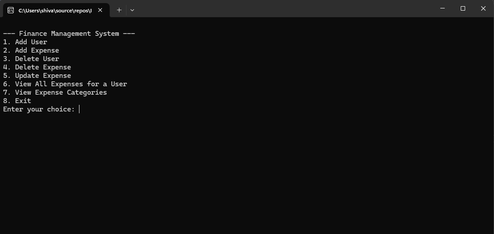
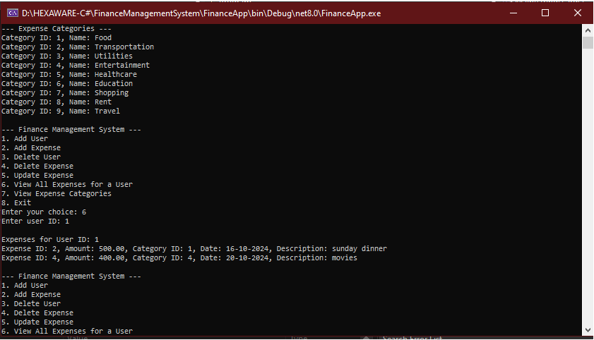

## **Finance Management System**

A simple Finance Management Console Application .

## **Introduction**

Finance Management app is a project that does something useful. It was created to solve managing expenses and finances.
---

---

## **Prerequisites**

To run this project you require latest version of:

1. Visual Studios
2. Microsoft SQL Server

## **Usage**

To use Project Title, follow these steps:

1. Open the project in your favorite code editor.
2. Modify The appSettings.json file under Util_Library and your own Connection String.
3. Build the project
4. Run the project using program.cs Entry Point.
5. Use the project as desired.

